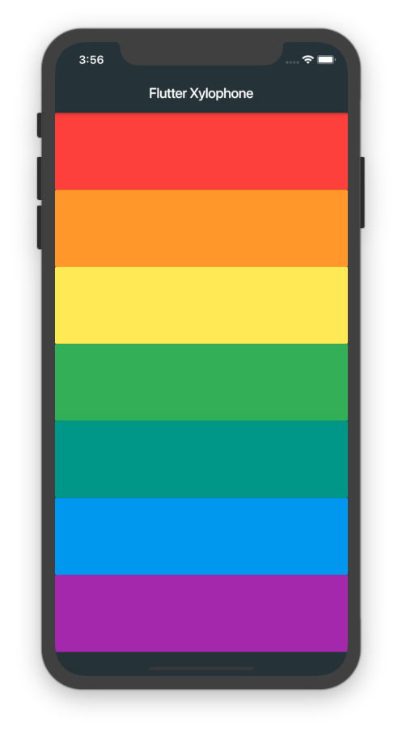

    

# Flutter Xylophone

A simple xylophone app that produce sounds upon touches. Developed using Flutter and third party library from Flutter Packages.

### Library Used

- Material
- Flutter Audioplayers

### Widgets / Classes Used

- StatefulWidget
- Scaffold
- AppBar
- SafeArea
- Column
- Colors
- Expanded
- FlatButton